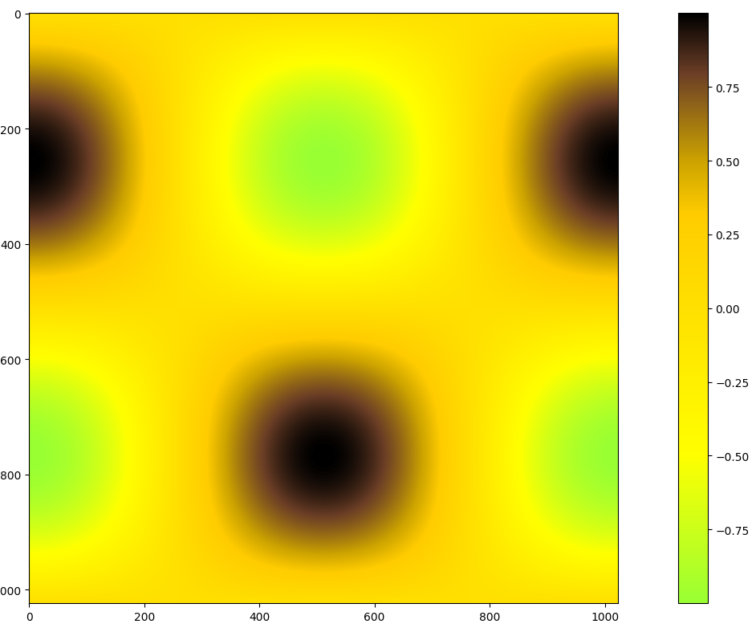

# Banana for scale

A Matplotlib colormap that uses banana colors.

```python
import numpy as np
import matplotlib.pyplot as plt
import banana_for_scale

t = np.linspace(0, 2 * np.pi, 1024)
data2d = np.sin(t)[:, np.newaxis] * np.cos(t)[np.newaxis, :]

fig, ax = plt.subplots()
im = ax.imshow(data2d, cmap="banana")

fig.colorbar(im, ax=ax)
plt.show()
```
